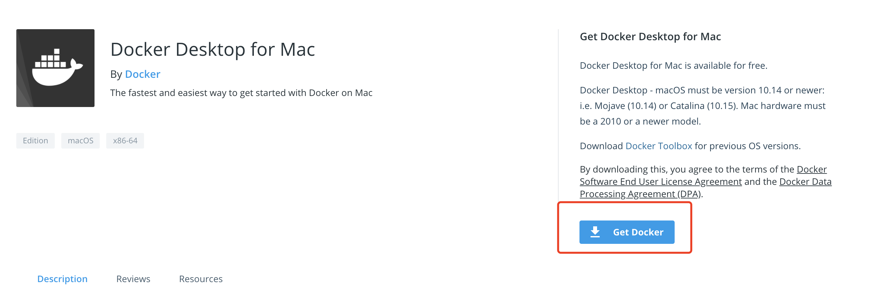

# Macbook安装

Macbook 安装 docker 一般用于开发人员，不可能用来当服务器。

### 安装之前必读

docker 需要 Linux 内核的支持，实际上是在 Windows/MAC 上安装一个 Linux虚拟器，docker 引擎跑在 Linux 虚拟机里。

### 系统要求

* Mac硬件必须是2010或更新的型号
* macOS必须为10.14或更高版本。
* 至少4 GB的RAM。
* 不得安装版本4.3.30之前的VirtualBox，因为它与Docker Desktop不兼容。

### 安装

进入[此页面点击](https://hub.docker.com/editions/community/docker-ce-desktop-mac/)下载 Docker.app

双击 Docker.dmg 打开安装程序，然后将Docker 图标拖到 Applications 文件夹。

双击 Docker.app 就可以用了。

当状态栏中的鲸鱼图标保持稳定时，Docker桌面将启动并运行，并且可以从任何终端窗口访问。

### 公众号

如果你想订阅我的文章，可以微信扫码关注我的公众号【机智的程序员小熊】，我是一个爱思考的程序员，专注于开发、运维、云技术、计算、网络、云存储、数据库、linux等编程知识

