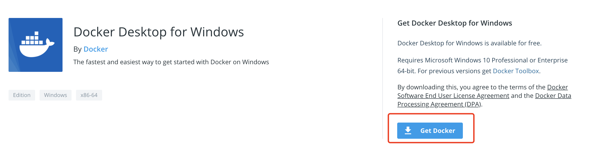

# Windows安装

win10 安装 docker 一般用于开发人员，用来当服务器使的很少。

### 安装之前必读

docker 需要 Linux 内核的支持，实际上是在 Windows/MAC 上安装一个 Linux虚拟器，docker 引擎跑在 Linux 虚拟机里。

Windows 版 docker 需要 Microsoft Hyper-V 的支持，即 Windows 内置的虚拟机引擎，从 win10 开始支持，docker在安装的时候会自动开启，需要重启电脑。

### 系统要求

* Windows 10 64位：专业版，企业版或教育版（内部版本16299或更高版本）。
* 必须启用Hyper-V和Containers Windows功能。
* 要在Windows 10上成功运行Client Hyper-V

### 安装

进入[此页面点击](https://hub.docker.com/editions/community/docker-ce-desktop-windows/)下载 Docker for Windows Installer.exe

双击Docker for Windows Installer.exe然后一路下一步，安装完成！

### 运行

安装完成后docker不会自动运行，搜索docker点击运行。

当状态栏中的鲸鱼图标保持稳定时，Docker桌面将启动并运行，并且可以从任何终端窗口访问。

### 参考

如果我的教程中没有你系统，或者想了解更多细节可以看
[官网](https://docs.docker.com/docker-for-windows/install/)
