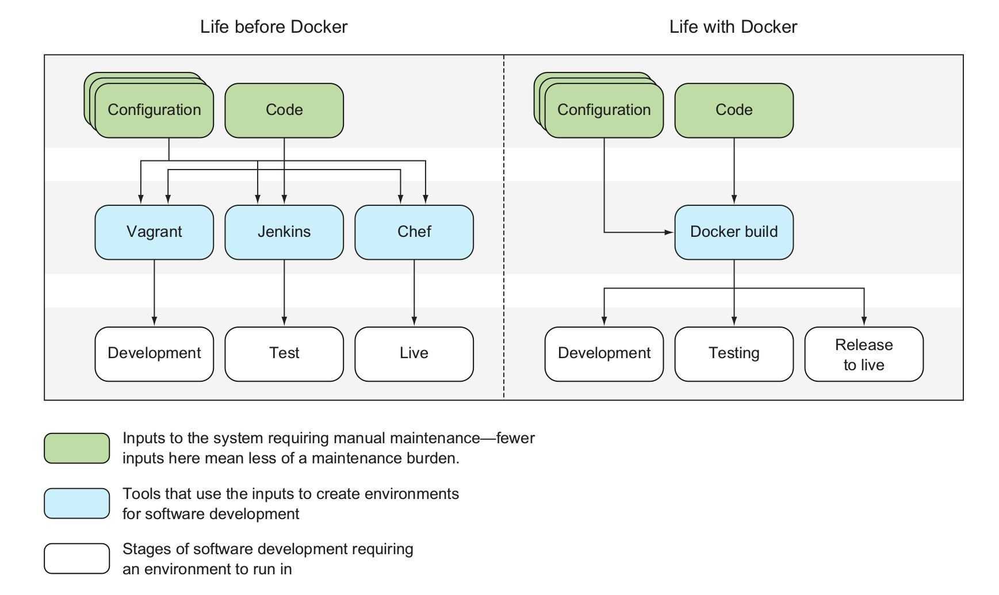

# Docker 能解决什么问题？

Docker 是一个开源的应用容器引擎，也就是管理容器的工具，基于 `Go` 语言开发，并遵从 `Apache2.0` 协议开源。

Docker 可以让开发者打包他们的应用以及依赖包到一个轻量级、可移植的容器中，然后发布到任何流行的 Linux 机器上，也可以实现虚拟化。容器是完全使用沙箱机制，相互之间不会有任何接口（类似 iPhone 的 App）, 更重要的是容器性能开销极低。

所以 Docker 解决的核心问题是**快速发布、快速构建开发与测试环境、让测试成功的环境与线上发布保持一致**

你可以用他做这些事情

* 开发一些工具打包运行环境，并提交到仓库，同事可以不用安装依赖，下载直接使用
* 用 Docker 封装应用依赖环境，新人入职无需手动安装环境，直接开始开发
* 在开发环境修复好 Bug 后，可以平滑升级到测试环境/生产环境，不会有任何差异