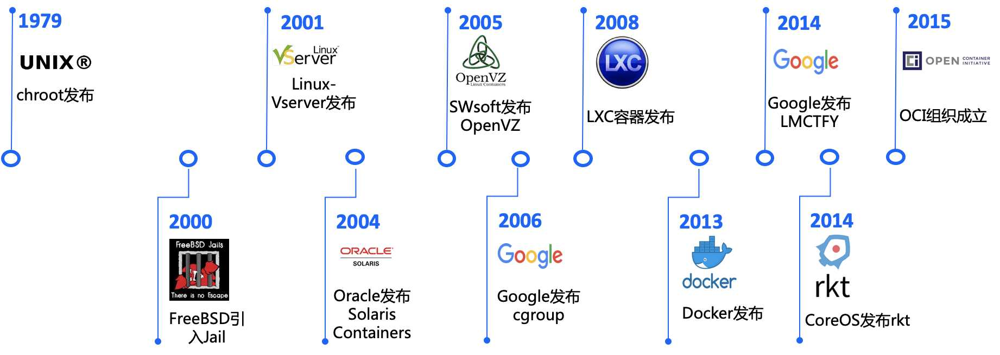

# 容器故事（Docker 核心技术）

容器技术实际上已经不是一个新概念了，早在 1979 年， `Chroot` 技术就出现了，我们知道在 `Linux` 系统里一切皆文件， `Chroot` 技术就是一种进程对文件系统的隔离，限制了进程能访问哪件文件不能访问哪件文件。

Unix版本7在开发过程中引入 `Chroot Jail` 以及 `Chroot` 系统调用，这就是最早的容器。2000 年的时候 `FreeBSD` 也引入了这个技术为进程做隔离。

后来的 2001 年到 2005 年 `VServer` 、 `Oracle Solaris Containers` 、 `OpenVZ` 把这种隔离和操作系统虚拟化技术结合，这种容器和操作系统的有一样的体系结构和内核版本，如果说你想不同于主机的内核版本下使用，跨内核不兼容的缺点就会很明显。

这个时候的容器不加以限制的使用，会跑满宿主机的资源

后来 2006 年 google 发布了 `cgroup` 技术，这个技术可以配置容器可使用多少宿主机的 `cpu` 、 `mem` 。

2008 年基于 `cgroups` 和 linux `namespace` 推出了第一个最为完善的 `Linux` 容器 `LXC` 。

`LXC` 用到的技术 `namespace` 是 `Linux` 内核用来隔离内核资源的方式。通过 `namespace` 可以让一些进程只能看到与自己相关的一部分资源，而另外一些进程也只能看到与它们自己相关的资源，这两拨进程根本就感觉不到对方的存在。

`namespace` 的隔离很强大，他有6项隔离能力，包括 UTS（主机名与域）名、IPC（信号量、消息队列和共享内存）、PID（进程编号）、Network（网络设备、网络栈、端口等等）、Mount（挂载点、文件系统）、User （用户和用户组）

基于这些 **隔离和限制技术**，dotCloud 公司（后更名为Docker）发布并开源了 Docker ，同时期也有很多容器技术纷纷出现，实际上 Docker 和这些现有的容器技术没有太大的不同 。

但因为 Docker 有一个叫做镜像的功能，可以完美的实现打包问题，类似于 iso 镜像的打包，只要把代码打包，无论在什么环境下都可以还原一个完全一样的出来。

所以短短几个月，Docker 项目就迅速崛起了，以至于其他容器项目还没有成为他的竞争对手就被打败了。

容器江湖风云变幻，没想到只是因为一个小小的细节，多少 容器管理产品走向死亡，令人唏噓不已。

通过了解容器的历史，我们知道了 Docker 所使用的两个核心技术

* namespace 隔离
* cgroup 限制

### 公众号

如果你想订阅我的文章，可以微信扫码关注我的公众号【机智的程序员小熊】，我是一个爱思考的程序员，专注于开发、运维、云技术、计算、网络、云存储、数据库、linux等编程知识

