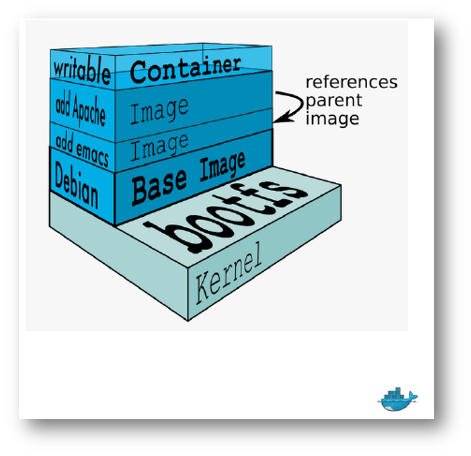

# 什么是镜像？

我们都知道，操作系统分为内核和用户空间。对于 `Linux` 而言，内核启动后，会挂载 `root` 文件系统为其提供用户空间支持。而 `Docker` 镜像（Image），就相当于是一个 `root` 文件系统。比如官方镜像 `ubuntu:18.04` 就包含了完整的一套 `Ubuntu 18.04` 最小系统的 `root` 文件系统。

`Docker` 镜像是一个特殊的文件系统，除了提供容器运行时所需的程序、库、资源、配置等文件外，还包含了一些为运行时准备的一些配置参数（如匿名卷、环境变量、用户等）。镜像不包含任何动态数据，其内容在构建之后也不会被改变。

### 镜像分层

* 一个镜像是由文件和一些元数据的集合
* 镜像由多个层所组成，多个层引用且基于另一个镜像
* 每个镜像包含了要运行的软件
* 每个镜像包含一个基础层
* Docker 在写文件系统时使用了副本

镜像构建时，会一层层构建，前一层是后一层的基础。每一层构建完就不会再发生改变，后一层上的任何改变只发生在自己这一层。比如，删除前一层文件的操作，实际不是真的删除前一层的文件，而是仅在当前层标记为该文件已删除。

在最终容器运行的时候，虽然不会看到这个文件，但是实际上该文件会一直跟随镜像。因此，在构建镜像的时候，需要额外小心，每一层尽量只包含该层需要添加的东西，任何额外的东西应该在该层构建结束前清理掉。

分层存储的特征还使得镜像的复用、定制变的更为容易。甚至可以用之前构建好的镜像作为基础层，然后进一步添加新的层，以定制自己所需的内容，构建新的镜像。

### 引用

[Docker 从入门到实践](https://yeasy.gitbook.io/docker_practice/basic_concept/container)

### 公众号

如果你想订阅我的文章，可以微信扫码关注我的公众号【机智的程序员小熊】，我是一个爱思考的程序员，专注于开发、运维、云技术、计算、网络、云存储、数据库、linux等编程知识

