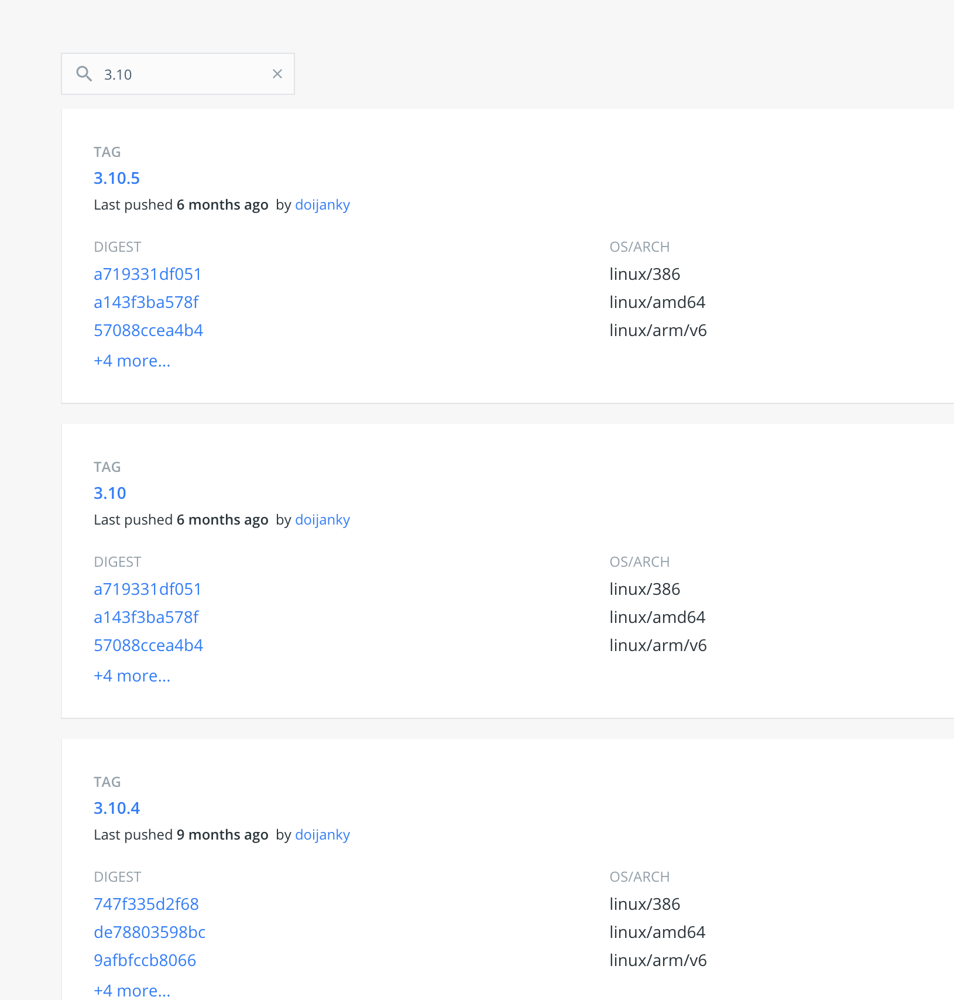

# 什么是仓库？

镜像构建完成后，可以很容易的在当前宿主机上运行，但是，如果需要在其它服务器上使用这个镜像，我们就需要一个集中的存储、分发镜像的服务， `Docker Registry` （docker 官方提供的镜像管理平台）就是这样的服务。

一个 `Docker Registry` 中可以包含多个 仓库（ `Repository` ）；每个仓库可以包含多个 标签（ `Tag` ）；每个标签对应一个镜像。

### tag

同一个仓库，就是给一个应用使用的，不同版本使用 `tag` 来标识。我们可以通过 `<仓库名>:<标签>` 的格式来指定具体是这个软件哪个版本的镜像。如果不给出标签，将以 `latest` 作为默认标签。

### tag 例子

以 `Ubuntu` 镜像 为例， `ubuntu` 是仓库的名字，其内包含有不同的版本标签，如， `16.04` , `18.04` 。

我们可以通过 `ubuntu:16.04` ，或者 `ubuntu:18.04` 来具体指定所需哪个版本的镜像。如果忽略了标签，比如 `ubuntu` ，那将视为 `ubuntu:latest` 。

### 仓库名两段式命令

仓库名经常以 **两段式路径** 形式出现，比如 `minibear2333/gitbook-export` ，前者一般代表 `Docker Registry` 中注册用户的用户名，后者对应的软件名。

全名： `minibear2333/gitbook-export:latest`

但这并不绝对，取决于所使用的具体 `Docker Registry` 的软件或服务。

也有使用三段式，分别是 私有镜像仓库 `url` 、不同层服务的名称、服务名称.

### 以后

关于怎么提交自己的镜像向个人仓库、怎么使用私人仓库，后面会讲到。

### 引用

[Docker 从入门到实践](https://yeasy.gitbook.io/docker_practice/basic_concept/container)
