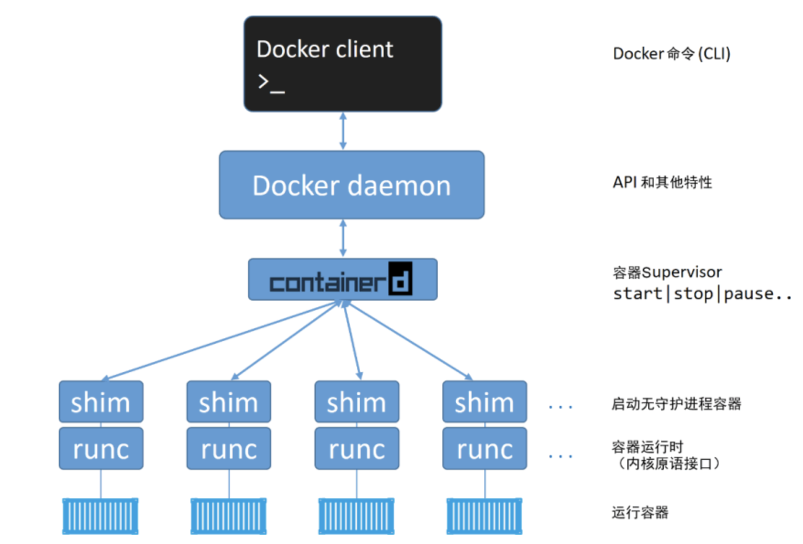

# Docker 安装教程

### Docker 包括

Docker 需要操作系统、管理工具、runtime

* 操作系统推荐使用 centos/unbunt ，而 windows 和 mac 在使用过程中会有一些网络问题，作为服务器使用 Linux 也更为轻便和通用
* 管理工具 - Docker Engine 
* runtime （runc）是 OCI 容器运行时规范的参考实现，runc 生来只有一个作用——创建容器

### Docker Engine 包括

* Docker CLI — docker向外暴露的命令行接口（Command Line API）
* Docker Daemon — docker 的守护进程，属于C/S中的server，向外暴露了 REST 接口(docker REST API)
* containerd 在对 Docker daemon 的功能进行拆解后，所有的容器执行逻辑被重构到一个新的名为 containerd（发音为 container-dee）的工具中，它的主要任务是容器的生命周期管理

因此，客户端访问服务端的方式有两种

* 一种是使用命令行工具，比如docker run， docker ps....
* 另一种就是直接通过调用REST API，比如发送一个curl http请求

### 安装说明

* 前提：能上网
* 命令行版本：CentOS、Debian、Fedora、Raspbian、Ubuntu
* 桌面版： macOS、Windows
* 安装网址：<a target="_blank" href="https://docs.docker.com/engine/install/" >https://docs.docker.com/engine/install/</a>

