<!--
_class: lead gaia
_paginate: false
-->

# Docker训练营
## 第一课、容器&docker入门

---
<!-- backgroundColor: white -->

## 关于讲师

瞿鹏志（小熊），就职于腾讯云私有云全栈云团队

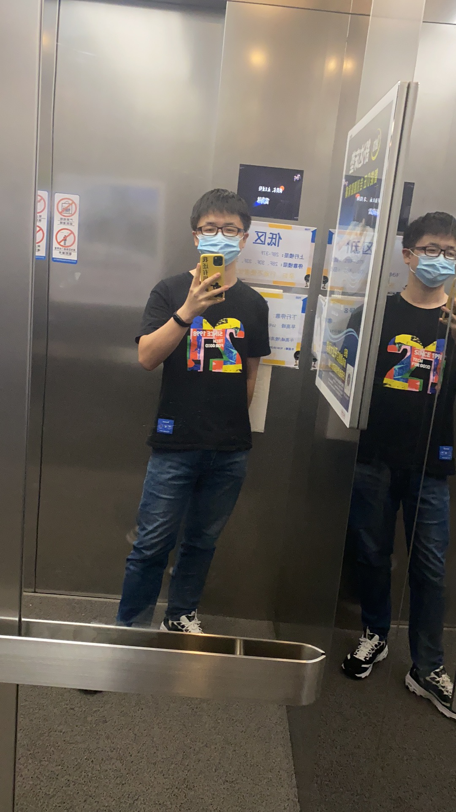

---

## 微信群

- 后期答疑
- 技术讨论
- 后期课程发布
- 容器技术实战

---
## 目录
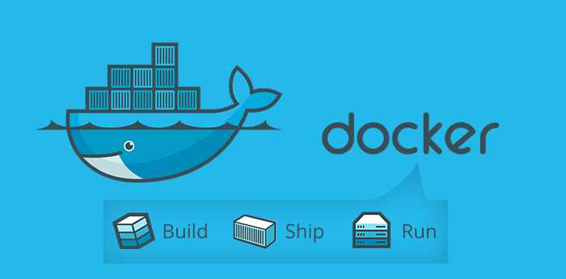

- 为什么要用容器
- 怎么理解容器
- 容器技术的历史进程
- Docker 所使用到的技术是什么？
- Docker 运行时
- Docker 镜像
- Docker 的安装

--- 
## 为什么要学容器-对于企业来说

降低计算成本、降低许可成本、可移植性灵活性、容器管理和自动化越来越好和廉价

<!-- 
存储、内存、cpu 高利用率
发行版本许可
在各云服务商之间迁移
应用容器市场容器管理和自动化领域激烈竞争，竞争将大大降低成本，而产品的功能和优势逐渐上升。
-->

---

### 对于个人开发者

- 环境标准化
- 版本控制
- 快速部署开发环境
- 跨平台性

<!-- 
开发与测试、线上环境的统一

-->

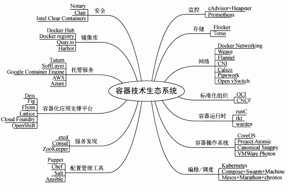

---
## 容器技术的本质
容器本质上是一个`集装箱`，它将应用运行依赖的`系统库`、`环境`及`应用程序`本身要包到一起，这样将整个集装箱迁移到另外的环境，可以保证程序`隔离不受干扰地`完美地运行起来。

---
## 容器与虚拟机的差异

* 共享资源的方式
* 故障转移能力
* 专门针对应用及其依赖环境
* 易于生成、运行、转移和部署
* …
* 容器也被称为操作系统级的虚拟化

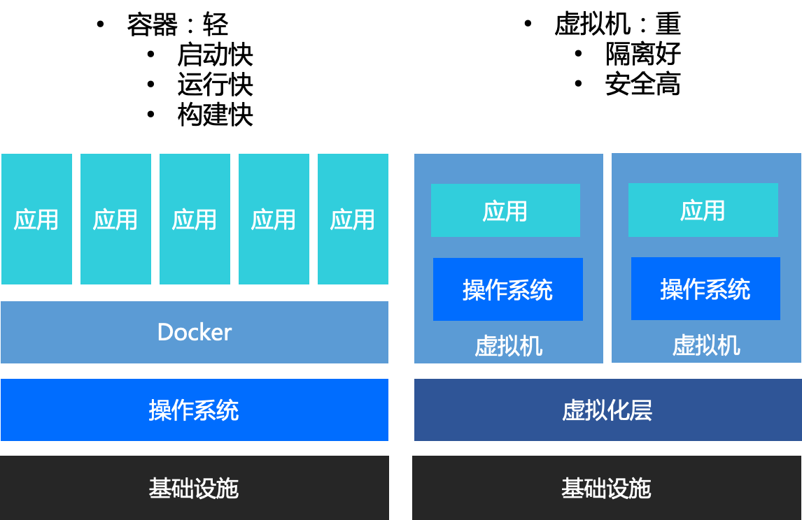

--- 

## Docker 技术发展史

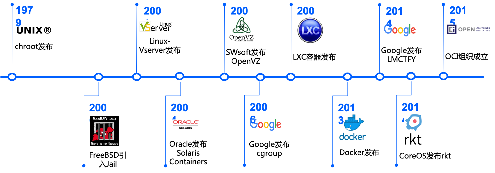

---

## 容器依赖的两大核心技术-内核的隔离技术
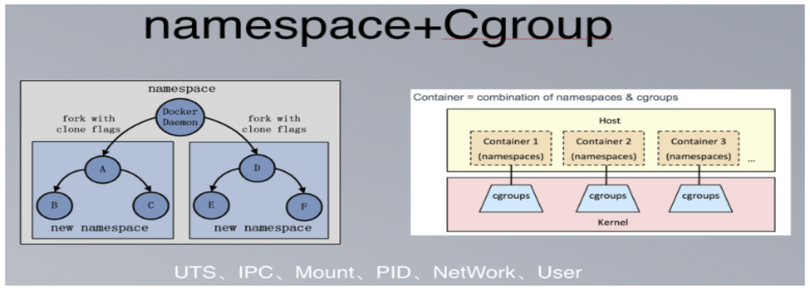

- Linux通过6大namespace, 就能在OS层面上同时运行多个相互独立的子系统
- Linux通过cgroup技术可以对资源进行划分

---
## 容器运行时
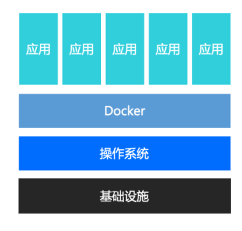
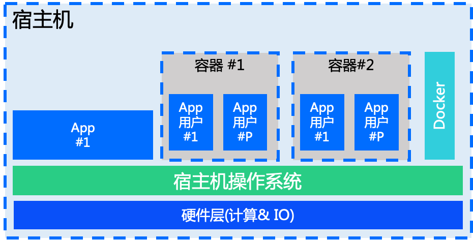

---
## 用户交互

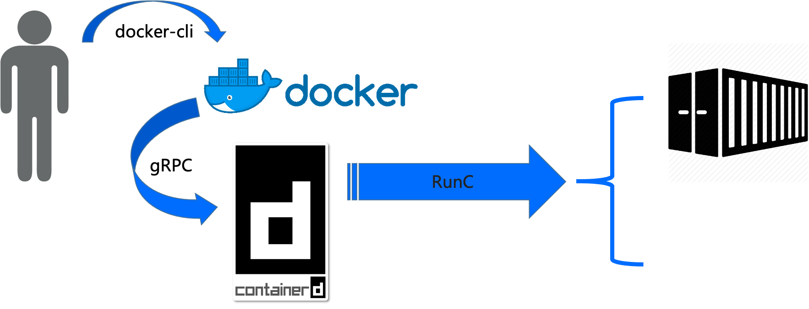

---
## Docker

是一套完整的守护进程、客户端等的工具组合。
主要的三个参与者：
* 客户端
* 守护进程
* 镜像仓库

---
## Docker

* 容器管理
* 镜像管理
* 数据卷管理
* 网络管理

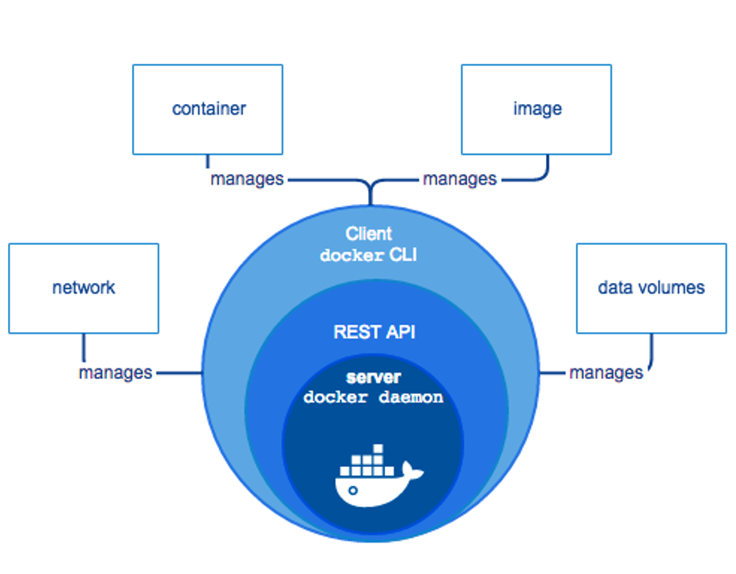

---
## Docker的秘密武器-镜像技术

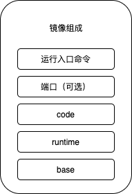

- 任意组件可做成镜像
- 最小化服务依赖
- 统一标准——跨环境迁移
- 快速构建，可集成
- 快速部署

---
## Docker的秘密武器-镜像技术

* 一个镜像是由文件和一些元数据的集合
* 镜像由多个层所组成，多个层引用且基于另一个镜像
* 每个镜像包含了要运行的软件
* 每个镜像包含一个基础层
* Docker 在写文件系统时使用了副本

---
## 实战

- 安装Docker
- 使用Docker运行一个 Hello world

