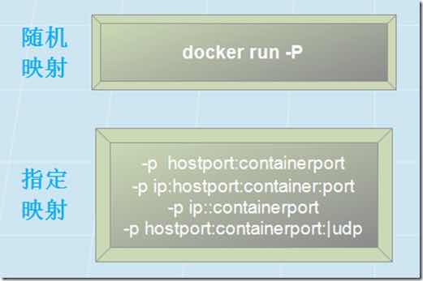

# 容器操作命令

容器控制

### 命令速查

|命令|	命令描述|
|:-----|:-----|
|create|	根据镜像生成一个新的容器|
|start|	启动一个新的容器|
|run|	创建、启动容器并执行相应的命令|
|rename|	重命名容器名|
|ps|	查看运行中的容器|
|top|	显示容器的运行进程|
|stop|	关闭容器|
|kill|	强制关闭容器|
|restart|	重启容器|
|pause|	暂停容器|
|unpause|	恢复暂停的容器|
|exec|	在已运行的容器中执行命令|
|attach|	进入运行中的容器, 显示该容器的控|制台界面。||
|logs|	打印容器的控制台输出内容|
|port|	容器端口映射列表|
|rm|	删除已停止的容器|
|diff|	展示容器相对于构建它的镜像内容所|做的改变||
|export|	导出容器到本地快照文件|
|cp|	在容器和宿主机之间复制文件|
|wait|	阻塞当前命令直到对应的容器被关闭, 容器关闭后打印结束代码|

### 最常用命令

``` BASH
docker  run  [OPTIONS]  IMAGE  [COMMAND]  [ARG...]
```

* `-d` : 后台运行容器，并返回容器ID
* `-i`：以交互模式运行容器，通常与 -t 同时使用
* `-t`：为容器重新分配一个伪输入终端，通常与 -i 同时使用
* `-v`：绑定挂载目录
* `--name="mycontainer"`: 为容器指定一个名称
* `--net="bridge"`: 指定容器的网络连接类型，支持 `bridge`、`host`、`none`
* `-p/-P` : 端口映射



### 启动/重启容器

``` BASH
docker start/restart CONTAINER
```

### 停止/强停容器

``` BASH
docker stop/kill CONTAINER
```

### 删除容器

``` BASH
docker rm [OPTIONS] CONTAINER [CONTAINER...]
```

### 重命名容器

``` BASH
docker rename CONTAINER CONTAINER_NEW
```

### 输出容器运行TTY日志 attach命令

将本地标准 input，output 和 error 流附加到正在运行的容器。

https://docs.docker.com/engine/reference/commandline/attach/

``` BASH
docker attach CONTAINER
```

ps：attach命令主要显示 ENTRYPOINT/CMD 进程的输出。看起来好像容器被挂起，该进程实际上根本就没有与终端进行交互。

### 执行容器命令

``` BASH
docker exec CONTAINER COMMAND
```

### 进入容器

当然 `sh` 也可以替换成 `bash`

``` BASH
docker exec -it CONTAINER sh
```

### 查看容器日志

查看全部日志

``` BASH
docker logs [OPTIONS] CONTAINER
```

实时打印容器日志，类似于 `tailf`

``` BASH
docker logs -f [OPTIONS] CONTAINER
```

### 查看容器列表

``` BASH
docker ps [OPTIONS]
```

### port命令

打印容器的端口映射
https://docs.docker.com/engine/reference/commandline/port/

``` BASH
docker port CONTAINER [PRIVATE_PORT[/PROTO]]
```

``` BASH
$ docker ps

CONTAINER ID        IMAGE               COMMAND             CREATED             STATUS              PORTS                                            NAMES
b650456536c7        busybox:latest      top                 54 minutes ago      Up 54 minutes       0.0.0.0:1234->9876/tcp, 0.0.0.0:4321->7890/tcp   test

$ docker port test

7890/tcp -> 0.0.0.0:4321
9876/tcp -> 0.0.0.0:1234

$ docker port test 7890/tcp

0.0.0.0:4321

$ docker port test 7890/udp

2014/06/24 11:53:36 Error: No public port '7890/udp' published for test

$ docker port test 7890

0.0.0.0:4321
```

### 公众号

如果你想订阅我的文章，可以微信扫码关注我的公众号【机智的程序员小熊】，我是一个爱思考的程序员，专注于开发、运维、云技术、计算、网络、云存储、数据库、linux等编程知识


