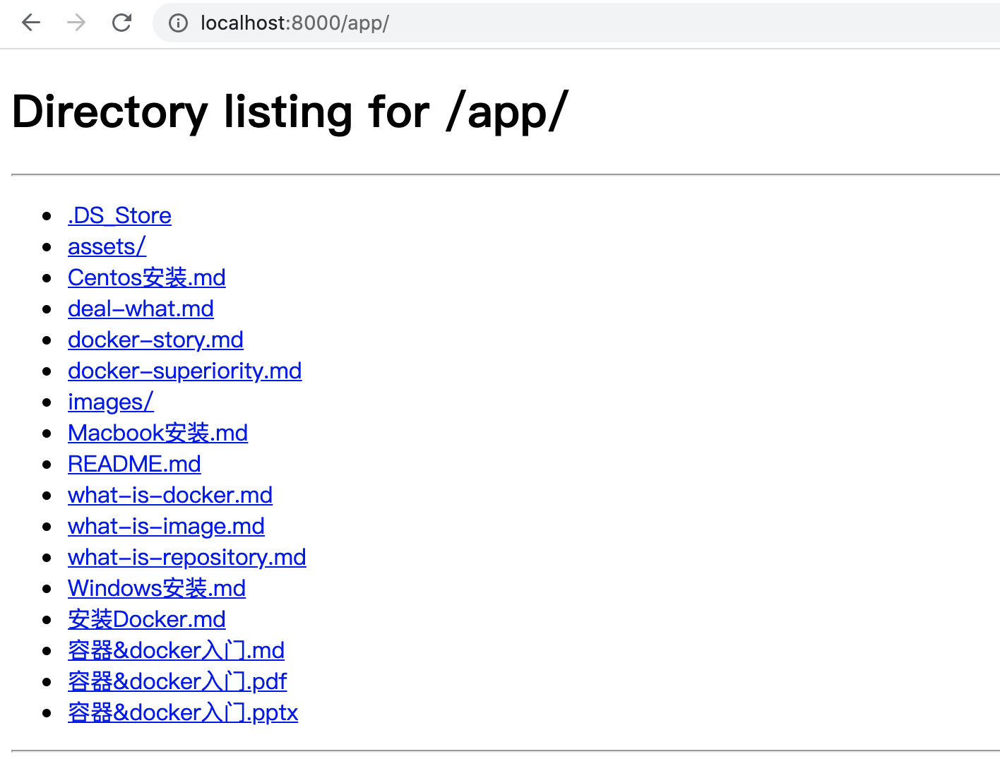

# python http服务实验

此实验可以提供一个无加密的下载服务，效果如下



### 执行命令

假设 `/home/kubernetes-book/Docker/chapter.1` 是你的本地目录所在位置

``` BASH
docker run -d -v 
/home/kubernetes-book/Docker/chapter.1:/app -p 8000:8000 python:alpine3.12 python -m http.server
```

可以看到这里把容器里的其他无关目录也映射进来了，解决的办法有两个：

1. 使用`python:latest`镜像，但是镜像大到5个G
2. 自己构建镜像，见下一节

### 公众号

如果你想订阅我的文章，可以微信扫码关注我的公众号【机智的程序员小熊】，我是一个爱思考的程序员，专注于开发、运维、云技术、计算、网络、云存储、数据库、linux等编程知识


