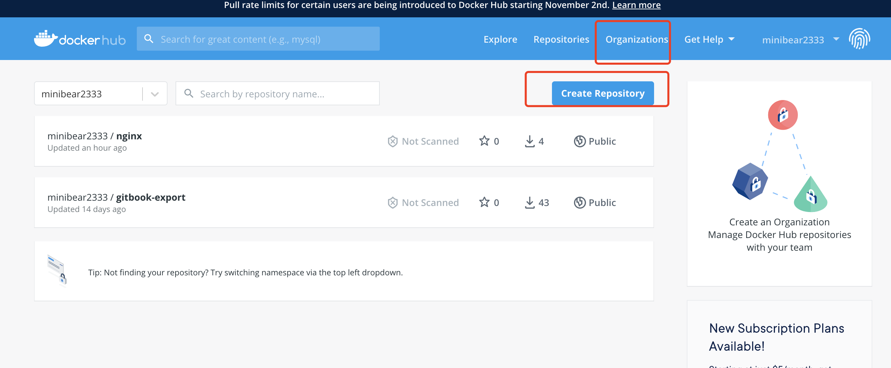
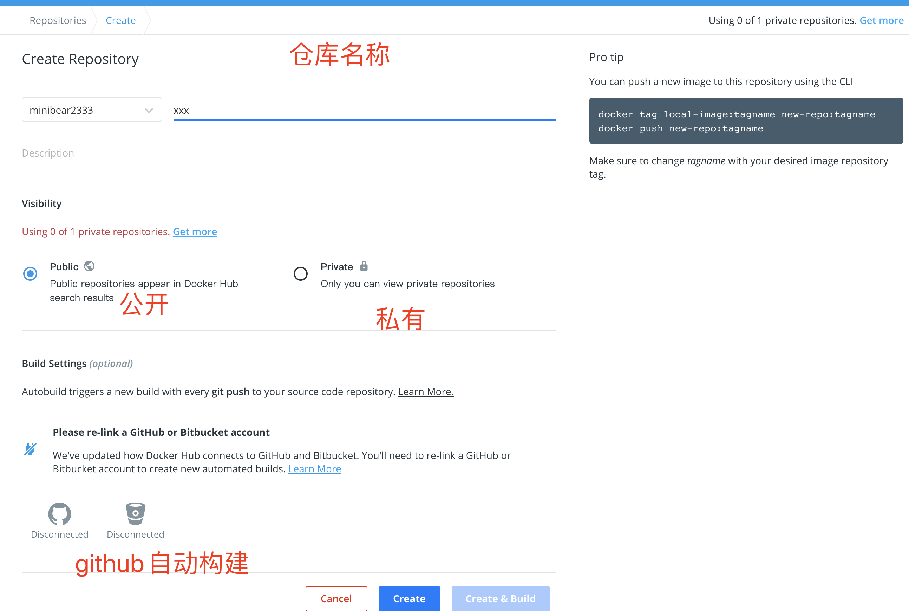

# 个人仓库

### 注册帐号并创建仓库

在此网站注册 [https://hub.docker.com](https://hub.docker.com/)，注册成功以后会跳到这个页面，点击创建仓库



公开仓库，名称任意



### 在本地login并提交镜像

输入用户名和密码

``` BASH
$ docker login -u minibear2333 -p xxxxxx
WARNING! Using --password via the CLI is insecure. Use --password-stdin.
Login Succeeded
```

提交镜像

``` BASH
docker push minibear2333/nginx:hello
```

个人仓库要在镜像名前加上个人用户名，比如我的是 `minibear2333`
